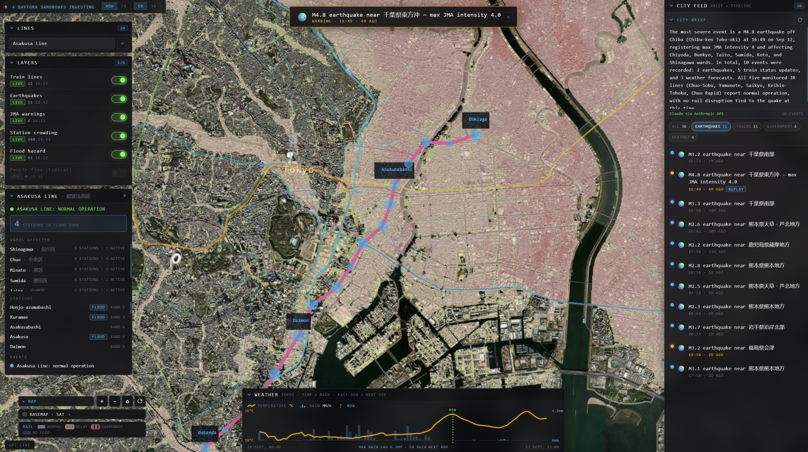

# TokyoPulse

A live Tokyo city-operations map, built in a 2-hour hackathon (Daytona HackSprint Tokyo). It fuses Tokyo's siloed real-time feeds — train delays, earthquakes, government weather warnings, flood hazard, station crowding — into **one connected graph with a time dimension** (past 7 days → now → next 48h), rendered as a CesiumJS globe with a tactical HUD.

The question it answers: *"what's happening around me right now, what happened earlier, and what's coming?"*



This is demo-grade code, built for a live 2-minute demo — not production. No auth, no persistence guarantees, no hardening. See `demo-runbook.md` for how to run and present it, `doc/prd.md` for the product spec, and `doc/arch.md` for the full architecture writeup.

---

## Architecture

```
┌─────────────────────────── DATA PLANE ────────────────────────────┐
│ LIVE FEEDS (streamed during demo)                                 │
│  ODPT trains   P2PQuake WS+hist   JMA warnings   Open-Meteo       │
│  (keyless)     (keyless)          (keyless)      (keyless)        │
│  [stretch: ODPT GTFS-RT buses — token]                            │
│                                                                   │
│ STATIC DATASETS (pre-downloaded at prep, loaded by seed loader)   │
│  Rail line GeoJSON (国土数値情報) · Station ridership counts       │
│  People-flow 1km mesh (MLIT 人流オープンデータ) · GSI flood tiles   │
│  [stretch: PLATEAU 3D Tiles]                                      │
└───────┬───────────┬───────────────┬────────────────┬──────────────┘
        ▼           ▼               ▼                ▼
        (live feeds only — static path goes straight to A3 seed
         loader → Neo4j/files; no Daytona sandbox needed)
┌──────────────── DAYTONA SANDBOX FAN-OUT (compute plane) ──────────┐
│  ingest-trains   ingest-quakes   ingest-warnings   ingest-weather │
│  · 1 sandbox per feed, launched in parallel (Python SDK)          │
│  · poll/subscribe → normalize → Event{} → write Neo4j             │
│  · each sandbox fails independently (godseye principle #2)        │
└──────────────────────────────┬────────────────────────────────────┘
                               ▼
┌───────────────────────── GRAPH PLANE ─────────────────────────────┐
│  Neo4j Aura Free                                                  │
│  Static seed (pre-2PM): (Line)-[:SERVES]->(Station)-[:IN]->(Ward) │
│  Live: (Event{type,severity,time,lat,lon,title})-[:AFFECTS]->     │
│        (Line|Ward)                                                │
└──────────────────────────────┬────────────────────────────────────┘
                               ▼
┌───────────────────────── API PLANE ───────────────────────────────┐
│  FastAPI (single file)                                            │
│  GET /events.json      · timeline + alerts (one Cypher, 2 views)  │
│  GET /lines.geojson    · rail geometry + live status color        │
│  GET /impact/{lineId}  · affected wards / stations-in-flood-zones │
│  GET /brief            · LLM JP/EN summary of timeline            │
│  GET /forecast.json    · cached Open-Meteo past48h+next48h        │
└──────────────────────────────┬────────────────────────────────────┘
                               ▼
┌──────────────────────── PRESENTATION PLANE ───────────────────────┐
│  Vite + React + CesiumJS  (godseye layout: map + HUD side panels) │
│  · Imagery: GSI std tiles (keyless) → OSM fallback                │
│  · Overlay: GSI flood-hazard ImageryLayer (alpha 0.55, toggleable)│
│  · Rail: GeoJsonDataSource polylines, color = status              │
│  · Quakes: PointPrimitives + pulse; camera.flyTo on timeline click│
│  · Crowd: station markers sized by ridership (static) +           │
│    people-flow heatmap layer (MLIT 1km mesh, pre-downloaded,      │
│    labeled "typical pattern") — toggleable                        │
│  · UI: LayerPanel · LineSearch · Timeline · AlertBanner ·         │
│        ForecastStrip · BriefCard · "⚡ N Daytona sandboxes" badge  │
└───────────────────────────────────────────────────────────────────┘
```

The one design idea that drives everything: **every feed normalizes into one `Event` shape**. The timeline feed, the alert banner, and the LLM brief are three different renderings of the same Neo4j query — build the query once, render it three ways. See `contracts/event.schema.json` and `contracts/api.md`.

**How Daytona is actually used:** sandboxes in this account have no outbound internet egress. So the host (which has egress) fetches each raw feed and pushes the payload into its sandbox; the sandbox runs that feed's pure `normalize()` function — real parallel compute on the critical path, inside Daytona — and hands the normalized events back to the host, which writes them to Neo4j Aura. Four sandboxes, created in parallel, each normalizing one feed, measured at 1.9-3.4 seconds startup. The code path for full in-sandbox fetch+ingest exists and needs no code change to flip on the moment account egress is enabled.

---

## Setup

**Prerequisites**

- **Python 3.12** with the project's `.venv` — dependencies are already installed there. For a fresh
  environment there is no `requirements.txt`; recreate it with:
  ```
  python -m venv .venv
  .venv\Scripts\python.exe -m pip install fastapi==0.141.1 uvicorn==0.52.4 neo4j==6.3.0 ^
      python-dotenv==1.2.3 httpx==0.28.1 websockets==17.1 daytona==0.211.2
  ```
  The `anthropic` SDK is deliberately **not** installed — `api/brief.py` calls the Messages API over
  raw `httpx`.
- **Node 24+** (built and verified on v24.11.1 / npm 11.6.2).
- **A Neo4j Aura instance.** Docker is *not* required and no `Dockerfile`/compose file ships with this
  repo; "Neo4j in a Daytona sandbox" is a documented fallback only (`doc/arch.md` §6, ladder #2).
- **`.env` populated from `.env.example`** — Neo4j credentials, optional `ANTHROPIC_API_KEY`, optional
  `DAYTONA_API_KEY`. Note that newer Aura Free instances use the **instance ID** as both
  `NEO4J_USERNAME` and `NEO4J_DATABASE`, not `neo4j`/`neo4j`; copy the values from the credentials
  file Aura makes you download, verbatim.

**One-time**

```
# seed the static graph (20 lines, 23 wards, 149 stations) - idempotent, safe to re-run
.venv\Scripts\python.exe scripts\seed.py

# install web dependencies
cd web && npm install && cd ..
```

**Run** — one terminal each, from the project root:

```
# terminal 1: API
.venv\Scripts\python.exe scripts\run_api.py          # -> http://127.0.0.1:8000

# terminal 2: web
cd web && npm run dev                                 # -> http://127.0.0.1:5173

# terminal 3: ingest - OPTIONAL, polls the live feeds into Neo4j.
# Auto-selects Daytona --push mode if DAYTONA_API_KEY is set, otherwise falls back
# to local in-process threads with status "mock". Without it the app still renders
# everything already in the graph; you just get no newly arriving events.
.venv\Scripts\python.exe -m ingest.launcher
```

Then open **`http://127.0.0.1:5173`**.

> **Use `127.0.0.1`, not `localhost`.** Vite binds only to `127.0.0.1:5173`, so if any other project's
> dev server is running on port 5173 with a default IPv6 bind, `localhost` resolves to *that* server
> over `::1` and this app is unreachable by that name. `127.0.0.1` is unambiguous. (The API binds
> `0.0.0.0:8000` per `API_HOST`, so it is reachable from your LAN — there is no auth, so keep that in
> mind on a shared network.)

Check it came up:

```
curl http://127.0.0.1:8000/health        # -> {"ok": true, "neo4j": "up", "eventCount": N}
```

Endpoints are `/events.json`, `/lines.geojson`, `/stations.geojson`, `/wards.geojson`,
`/impact/{lineId}`, `/forecast.json`, `/weathergrid.json`, `/brief`, `/sandboxes.json`, `/layers.json`,
plus `POST /demo/replay` and `POST /demo/reset`. Full interactive list at
`http://127.0.0.1:8000/docs`.

Full step-by-step with expected output at every stage, plus the demo script and failure playbook: **`demo-runbook.md`**.

---

## Data sources

All feeds are keyless except where noted. See `contracts/feeds.json` for pinned, verified URLs.

| Feed | What it powers | Keyless? | Coverage / caveat |
|---|---|---|---|
| ODPT `TrainInformation` | Live line status (normal/delay/suspended) | Yes | **Toei operator only — 6 lines.** No JR-East, no Tokyo Metro on the keyless mirror; those 14 lines render grey `unknown`, honestly — the graph models them, the feed doesn't cover them. |
| ODPT `Railway` + `Station` | Rail polyline geometry, station coordinates | Yes | 149 stations, all with lat/long — built real geometry with no licence-gated download. |
| P2PQuake history + WS | Earthquakes, past 7 days + live | Yes | Live WS can be silent for hours; `POST /demo/replay` fires a scripted real payload on cue for the demo. |
| JMA warnings (Tokyo 130000) | Government weather warnings | Yes | Deduplicated to distinct advisories. |
| Open-Meteo | Past 48h + next 48h temperature/precipitation | Yes | Official forecast/history only — no ML prediction. |
| GSI std/pale tiles | Base map imagery | Yes | — |
| GSI flood-hazard tiles | Flood overlay | Yes | Raster overlay, always "live" (static tile service). |
| Station ridership (static) | Crowd marker sizing | Yes (pre-downloaded) | Static, not real-time. |
| MLIT people-flow 1km mesh | "Typical pattern" heatmap layer | Yes (pre-downloaded) | **Derived proxy from static station ridership, distance-weighted — not real-time telco people-flow.** Real MLIT 人流 data is licence-gated; labeled honestly wherever it appears, off by default. |
| ODPT bus GTFS-RT | Live bus positions | No (needs token) | Cut — stretch layer, `ODPT_ACCESS_TOKEN` was never provisioned. |

---

## What's real vs. demo-grade

**Real, live, and running against production services right now:**
- Train status, earthquakes, government warnings, and weather are fetched live on a poll and written to a real Neo4j Aura instance.
- The Impact panel (ward/flood-zone breakdown for a selected line) is a real Cypher query against real graph relationships, not a canned response.
- Four Daytona sandboxes really are created per run and really do run the normalize step for their feed.
- The city brief really is generated fresh per refresh from the live event set (currently via the Anthropic API).
- Every endpoint follows a real three-tier resolver (live → cache → mock) and never 500s on a dead upstream — a degraded response with an honest badge, always.

**Demo-grade, and honestly labeled as such in the UI:**
- Line status covers Toei only (6 of 20 lines); the rest are real graph nodes with real geometry but no live feed, rendering grey `unknown` by design.
- The people-flow heatmap, where shown, is a static-ridership-derived proxy, not real telco data — labeled "typical pattern".
- The Anthropic-backed brief is a fallback for Nosana, which is roadmap for this build; a deterministic rule-based template is the guaranteed no-network floor beneath both.
- Daytona sandboxes in this account have no outbound egress, so they normalize a host-fetched payload rather than fetching the feed themselves — real parallel compute on the critical path, just not the network hop too.
- `POST /demo/replay` exists specifically because a live earthquake can't be guaranteed on cue; replayed events are tagged `REPLAY` in the UI, never disguised as live.
- No auth, no production hardening, no persistence guarantees — this is a 2-hour build meant to run once, live, and tell an honest story about what's real.
